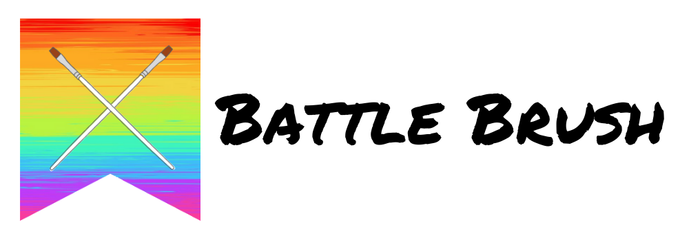
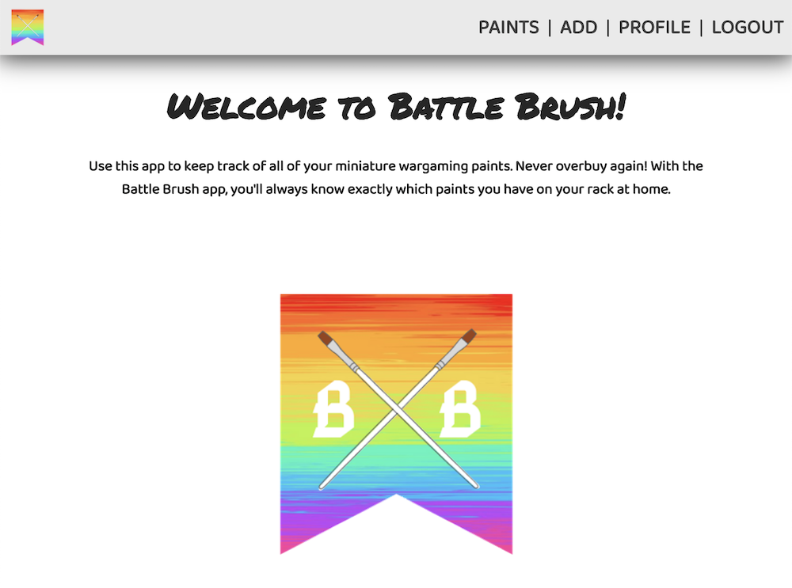
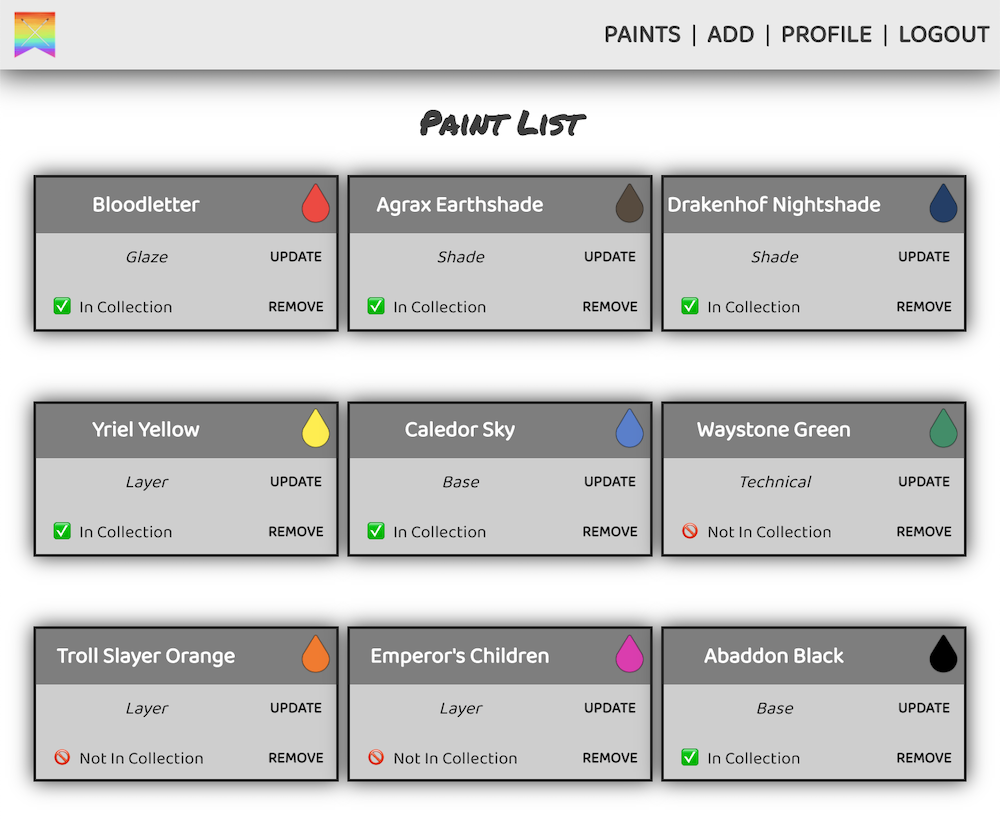
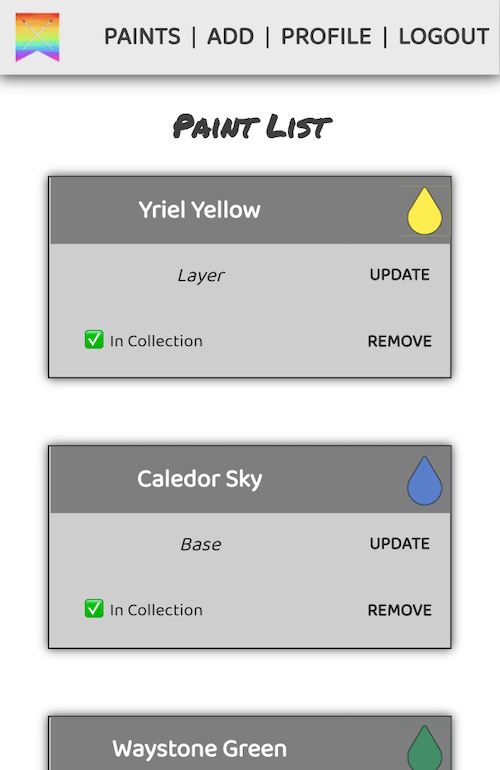

## Date: 4/20/2020

### By: Michael Lackey
#### [Website](https://michaellackey.com/) | [GitHub](https://github.com/mlackey9601) | [LinkedIn](https://www.linkedin.com/in/michaelglackey/) | [Vettery](https://www.vettery.com/ga/employers)
***

### ***Description***

##### Battle Brush is a full-stack MERN application that makes it easy to track miniature wargaming hobby paints.
***

### ***Technologies Used***

##### ***Additional Technologies***
* ###### Chajr 1.2.2
***

### ***Getting Started***

##### Start by signing up a new user and then begin adding paints to your list!
##### A Trello board was used to keep track of development progress and can be viewed [here](https://trello.com/b/g6V7Aji2/battlebrush).
##### The project itself was deployed using Heroku and can be viewed [here](https://battlebrush.herokuapp.com/).
***

### ***Screenshots***

###### Welcome Page

###### Paint List

###### Mobile Responsive

***

### ***Future Updates***

- [x] ~~Make app scale for mobile~~
- [x] ~~Add Contrast and Primer to the Paint Schema~~
- [ ] Add ability to create 'swatches' for paint progressions
- [ ] Add 'brand' to the Paint model
- [ ] Add sorting/searching
- [ ] Let users search through all added paints and add others' created paints to their collection
- [ ] More content on the profile page
- [ ] No more 'white' background
- [ ] New app logo
***

### ***Credits***

##### App Scaffolding: [Chajr 1.2.2](https://github.com/davidstinson/chajr)

##### Color Picker: [React Color](https://casesandberg.github.io/react-color/)
***
