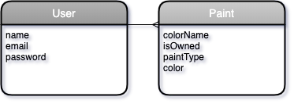

# **Battlebrush**

### Date: 4/20/2020

#### By: Michael Lackey
#### [Website](https://michaellackey.com/) | [GitHub](https://github.com/mlackey9601) | [LinkedIn](https://www.linkedin.com/in/michaelglackey/) | [GA Profile](https://profiles.generalassemb.ly/michaellackey)
***

### ***Description***

##### A full-stack MERN application for tracking miniature wargaming paints.
***

### ***Technologies Used***

* ##### Chajr
* ##### HTML
* ##### CSS
* ##### JavaScript
* ##### MongoDB/Mongoose
* ##### Node/Express
* ##### React
* ##### Heroku
***

### ***Getting Started***

##### Start by signing up a new user and then begin adding paints to your list!
##### A Trello board was used to keep track of development progress and can be viewed [here](https://trello.com/b/g6V7Aji2/battlebrush).
##### The project itself was deployed using Heroku and can be viewed [here](https://battlebrush.herokuapp.com/).
***

### ***Screenshots***

###### Entity Relationship Diagram

###### Welcome Page

###### Paint List

***

### ***User Experience***

#### User Story #1
##### Michael loves to paint, but everytime he's at the hobby store he buys paint colors he already has. He needs a way to keep track of which paints he has and which paints he wants.
#### User Story #2
##### Aaron runs a hobby supply store. He wants to keep track of which paints he has in stock, and which he needs to order.
#### As a user...
* ##### I should be able to sign up as a new user.
* ##### I should be able to log in with my new account.
* ##### I should be able to create a new paint.
* ##### I should be able to view the details of my paint.
* ##### I should be able to edit my paint.
* ##### I should be able to remove a paint.
* ##### I should be able to log out of my account.
***

### ***Future Updates***

- [x] ~~Make app scale for mobile~~
- [ ] Consume data from a third-party API
- [ ] Implement additional functionality if the user is an admin
***

### ***Credits***

##### App Scaffolding: [Chajr](https://github.com/davidstinson/chajr)
***
